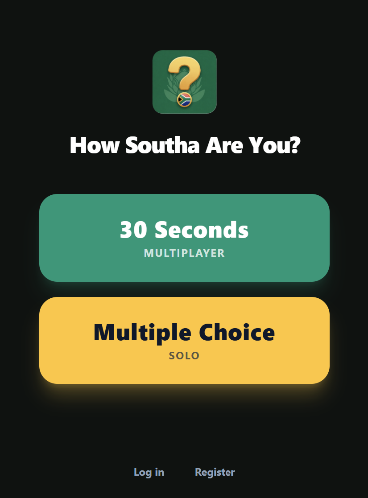
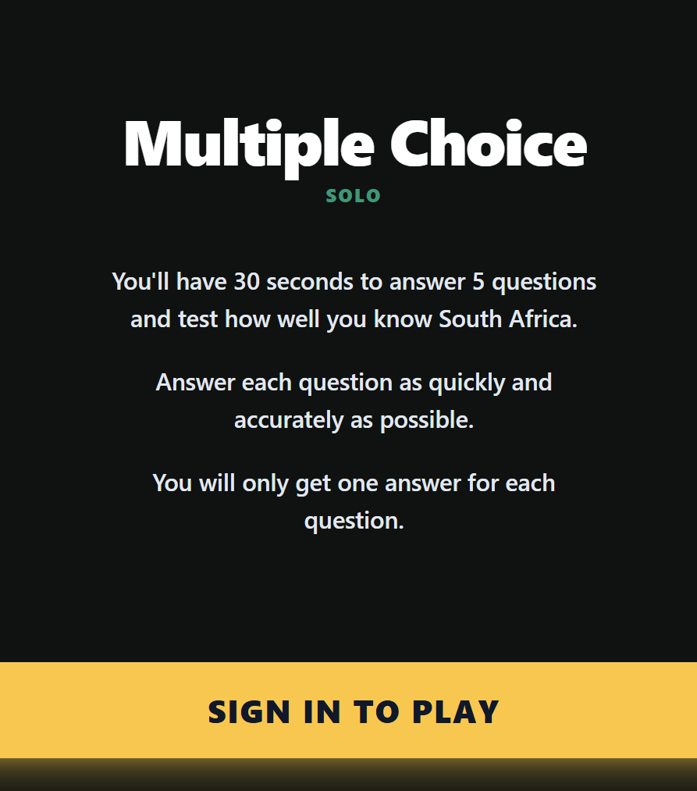
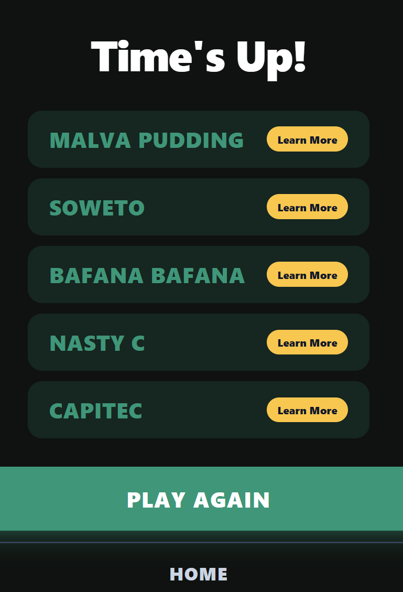
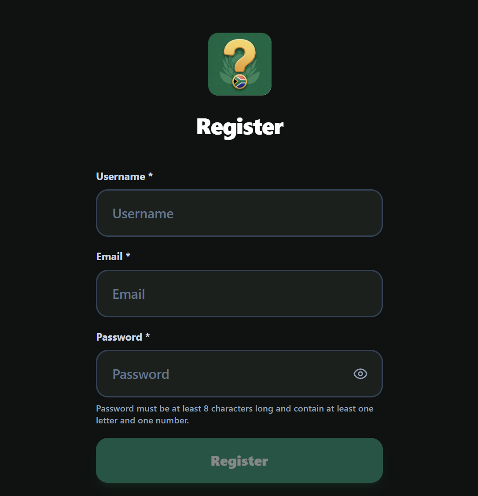
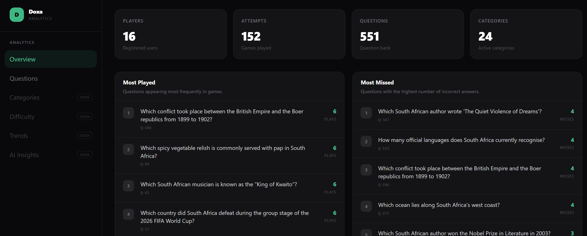

# How Southa Are You?

A South African trivia and party game web application built with a Spring Boot backend, SvelteKit frontend, and Neon PostgreSQL database, accompanied by a dedicated analytics and AI insights layer (Doxa).



## Features

* **Multiple Game Modes:** Test your South African heritage with various trivia rules and fast-paced rounds.
* **Responsive SvelteKit Frontend:** Optimized for desktop and mobile devices.
* **Spring Boot API:** Robust backend handling game state, users, categories, and attempts.
* **Doxa Analytics Layer:** Dedicated FastAPI and Svelte dashboard tracking game questions and statistics.

---

## Screenshots

| Homescreen | Game Rules |
| :---: | :---: |
|  |  |

| Gameplay | Registration / Auth |
| :---: | :---: |
|  |  |

| Analytics Dashboard (Doxa) |
| :---: |
|  |

---

## Tech Stack

* **Frontend:** SvelteKit, TypeScript, Tailwind CSS
* **Backend:** Spring Boot (Java), Maven
* **Analytics:** FastAPI (Python), Svelte
* **Database:** PostgreSQL (Neon)

---

## Running Locally

### 1. Backend
```bash
cd backend
./mvnw spring-boot:run
```

### 2. Frontend
```bash
cd frontend
npm install
npm run dev
```

### 3. Analytics
```bash
cd analytics/backend
uv run uvicorn app.main:app --reload

cd analytics/frontend
npm install
npm run dev
```
